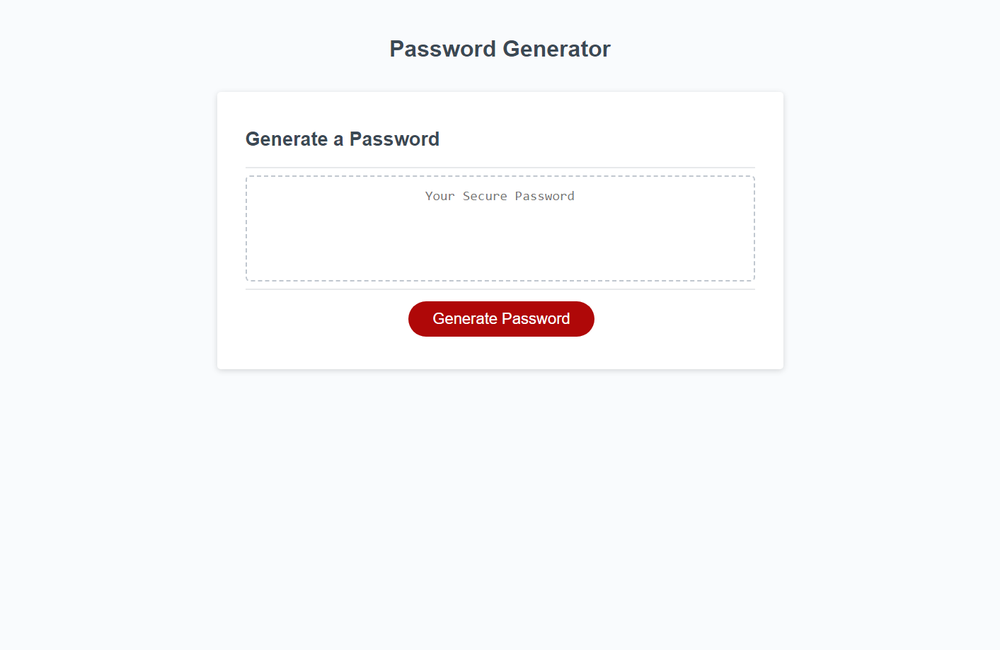

# Title
Password-generator

## Description
This password generator represents my first introduction toward JavaScript by allowing me to come up with my own solutions for some rudimentary starting code. Although this doesn't yet get into the back end of development, it does give me a peak into what that world will soon look like. Now users can visit this mini project and generate a password as long as they provide a few small parameters. Given they have provided a character amount between a minumum of 8 and a maximum of 128, character options for the random password will vary.  

## Usage

## Git hub
 [Deployed link](https://thomasvtran.github.io/password-generator/)